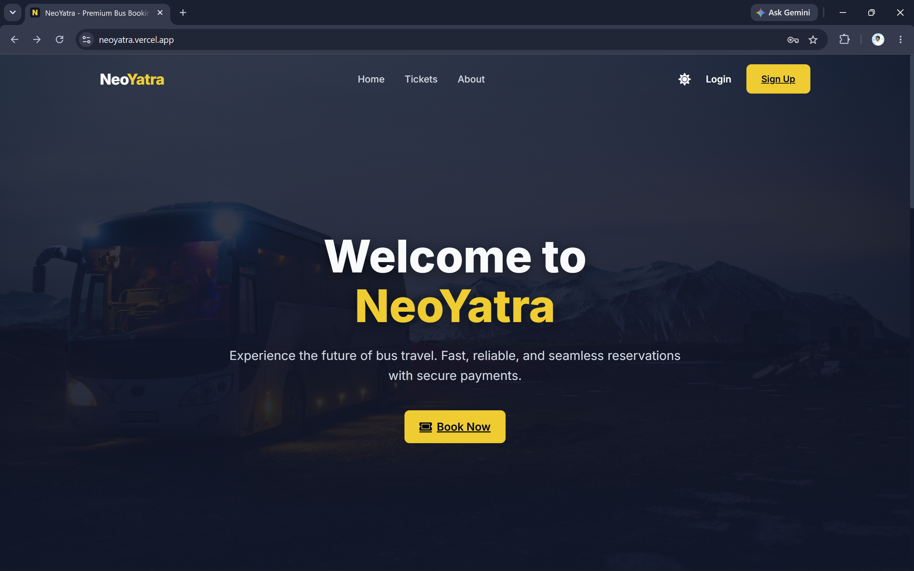
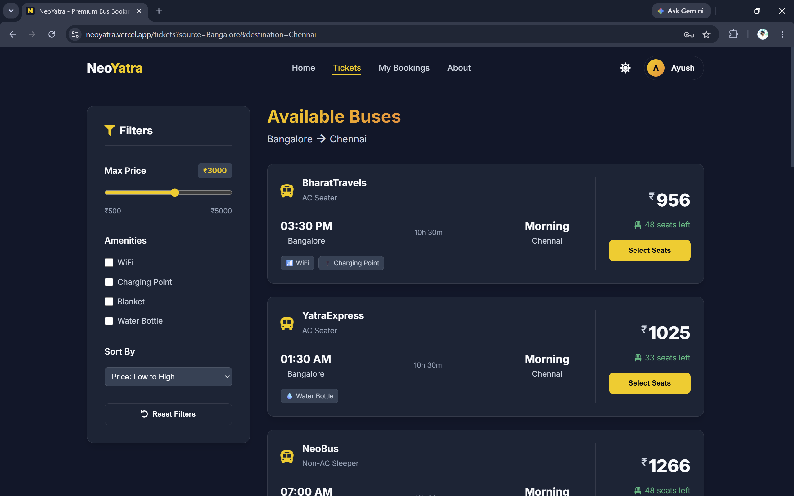
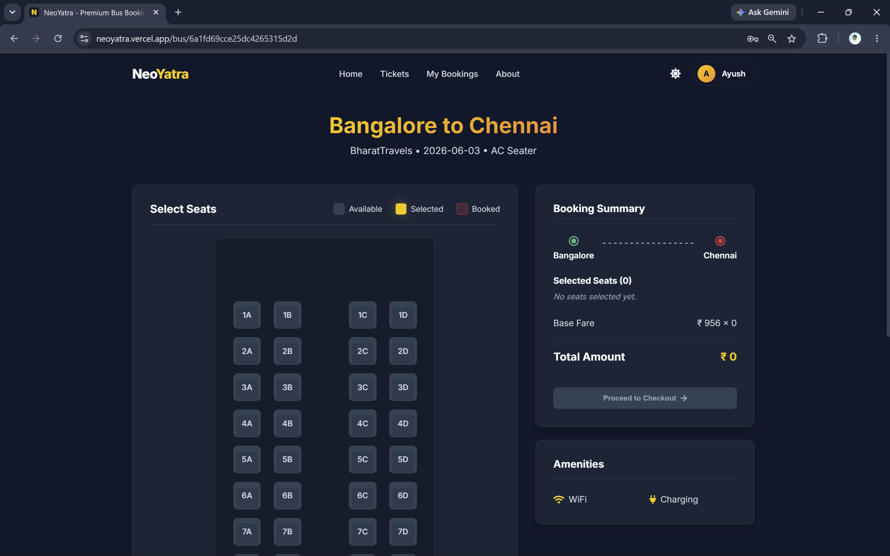
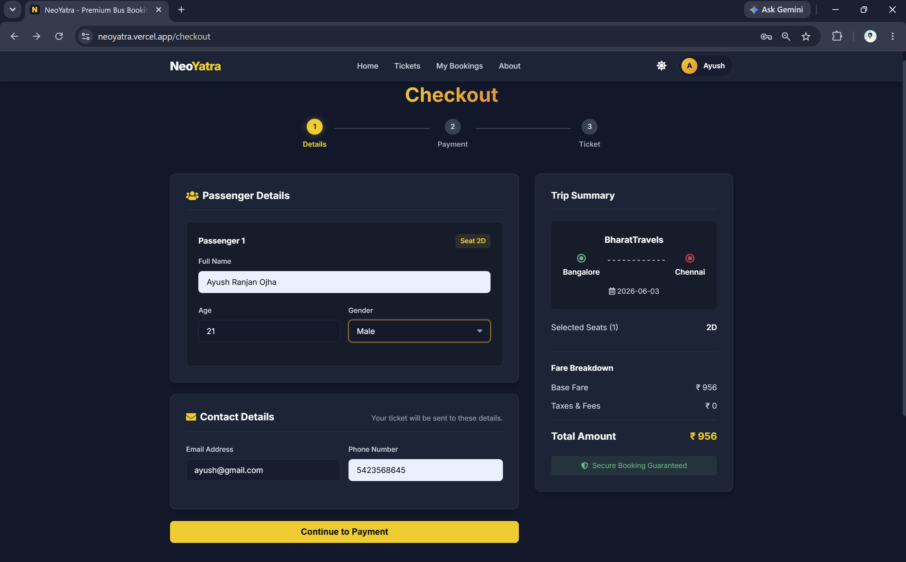
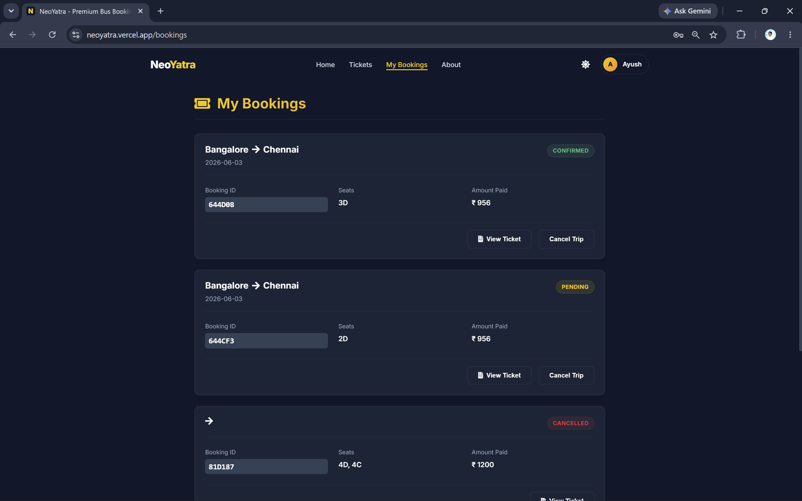

# 🚌 NeoYatra – Premium Bus Booking Platform

A full-stack **MERN-based bus reservation platform** that enables users to search buses, apply filters, select seats, manage bookings, and complete reservations through a modern, responsive interface.

🌐 **Live Demo:** https://neoyatra.vercel.app
⚙️ **Backend API:** https://neoyatra-backend-ta7g.onrender.com/api/health

---

## 🚀 Highlights

* Full-Stack MERN Application
* JWT-Based Authentication & Authorization
* RESTful API Architecture
* Advanced Bus Search & Filtering
* Responsive Mobile-First Design
* MongoDB Atlas Cloud Database
* Production Deployment on Vercel & Render
* Context API State Management
* Secure Backend Validation with Zod

---

## 📌 Overview

NeoYatra is a modern bus booking system inspired by real-world travel platforms such as RedBus and AbhiBus.

The platform provides an end-to-end booking workflow, allowing users to:

* Register and authenticate securely
* Search buses across routes
* Apply advanced filters and sorting
* Select seats and book tickets
* Manage bookings through a personalized dashboard

This project demonstrates practical full-stack engineering concepts including authentication, API development, database design, state management, deployment, and scalable application architecture.

---

## ✨ Features

### 👤 User Features

* User Registration & Login
* Secure JWT Authentication
* Protected Routes
* User Profile Management
* Booking History Dashboard

### 🚌 Booking Features

* Search Available Buses
* View Detailed Bus Information
* Seat Selection System
* Booking Confirmation Workflow
* Booking Management

### 🔍 Search & Filtering

#### Filters

* Maximum Price Filter
* WiFi Availability
* Charging Point
* Blanket Availability
* Water Bottle Availability

#### Sorting

* Price: Low → High
* Price: High → Low
* Available Seats: Low → High
* Available Seats: High → Low

### 📱 Platform Features

* Fully Responsive Design
* Mobile-Friendly Interface
* Context API State Management
* RESTful Backend APIs
* MongoDB Atlas Integration

### 🛠 Admin Features

* Admin Authentication
* Bus Management
* Booking Monitoring
* Route Administration

---

## 🏗️ System Architecture


### Architecture Flow

```text
User
 ↓
React Frontend (Vite)
 ↓
Express REST API
 ↓
MongoDB Atlas
```

### Deployment Flow

```text
User
 ↓
Vercel Frontend
 ↓
Render Backend
 ↓
MongoDB Atlas Database
```

---

## 📸 Screenshots

### Landing Page



### Bus Search Results



### Bus Details



### Checkout Page



### My Bookings



---

## 🛠 Tech Stack

### Frontend

* React.js
* Vite
* React Router
* Context API
* Axios
* CSS3

### Backend

* Node.js
* Express.js
* REST API
* JWT Authentication
* bcryptjs

### Database

* MongoDB Atlas
* Mongoose

### Validation

* Zod

### Deployment

* Vercel
* Render
* MongoDB Atlas

### Version Control

* Git
* GitHub

---

## 📂 Project Structure

```text
NeoYatra/
│
├── public/
│
├── src/
│   ├── components/
│   ├── context/
│   ├── pages/
│   ├── services/
│   └── App.jsx
│
├── neoyatra-backend/
│   ├── config/
│   ├── controllers/
│   ├── middleware/
│   ├── models/
│   ├── routes/
│   ├── validators/
│   ├── sockets/
│   ├── seed.js
│   └── server.js
│
├── screenshots/
│
├── package.json
└── README.md
```

---

## ⚙️ Local Setup

### Clone Repository

```bash
git clone https://github.com/ayushojha0405/NeoYatra.git

cd NeoYatra
```

### Frontend Setup

```bash
npm install
npm run dev
```

Frontend runs on:

```text
http://localhost:5173
```

### Backend Setup

```bash
cd neoyatra-backend

npm install

npm run dev
```

Backend runs on:

```text
http://localhost:5000
```

---

## 🔐 Environment Variables

Create a `.env` file inside the backend directory:

```env
MONGO_URI=your_mongodb_uri
JWT_SECRET=your_secret_key
ADMIN_EMAIL=admin@example.com
CORS_ORIGIN=http://localhost:5173
```

---

## 🗄 Database Seeding

Populate sample buses and admin data:

```bash
cd neoyatra-backend

node seed.js
```

---

## ☁️ Deployment

| Component | Platform      |
| --------- | ------------- |
| Frontend  | Vercel        |
| Backend   | Render        |
| Database  | MongoDB Atlas |

---

## 🔒 Security Features

* JWT-Based Authentication
* Password Hashing with bcryptjs
* Protected Routes
* Request Validation using Zod
* Environment Variable Protection
* Secure API Access Control

---

## 🔮 Future Enhancements

* Online Payment Gateway Integration
* PDF Ticket Generation
* Booking Cancellation Workflow
* Passenger Reviews & Ratings
* Email Notifications
* Live Bus Tracking
* Docker Containerization
* CI/CD Pipeline Automation

---

## 👨‍💻 Author

**Ayush Ranjan Ojha**

* MERN Stack Developer
* Full-Stack Engineering Enthusiast
* Cloud & AI Learner

---

## 📜 License

This project is intended for educational, learning, and portfolio purposes.
